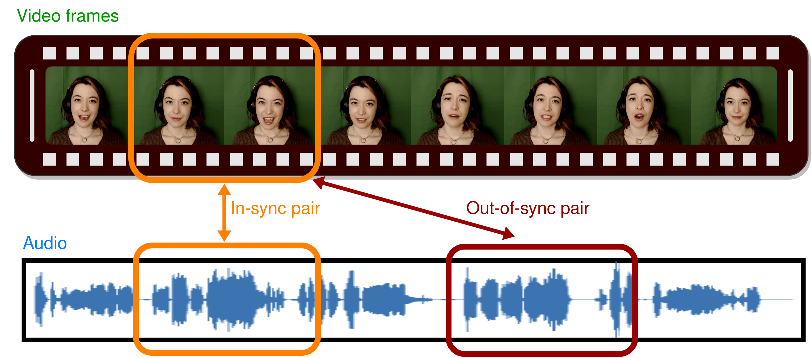
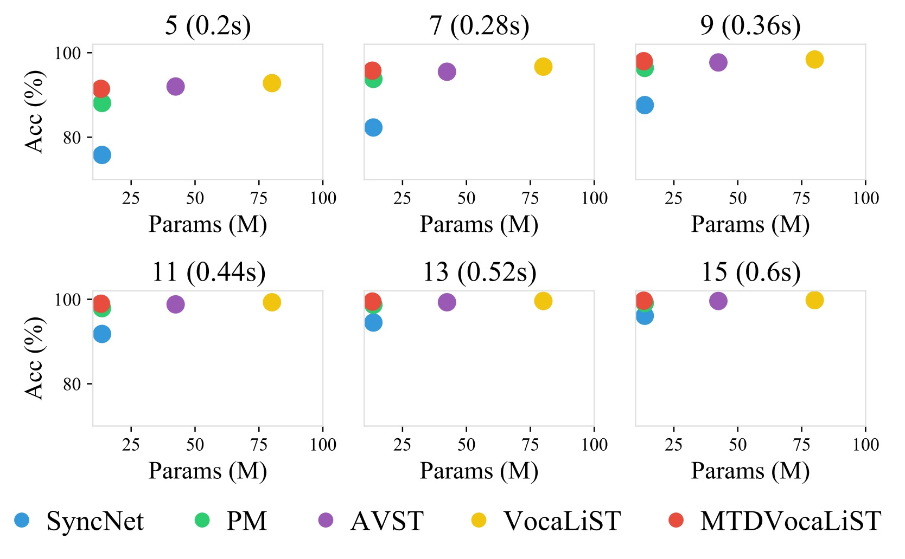

# MTDVocaLiST
We proposed a lightweight audio-visual synchronization (AVS)model **[MTDVocaLiST](https://arxiv.org/abs/2210.15563)**. MTDVocaLiST reduces the model size of **[VocaLiST](https://github.com/vskadandale/vocalist)** by 83.52%, yet still maintaining similar performance. For more details about VocaLiST, please visit its [[project webpage]](https://ipcv.github.io/VocaLiST/).
Audio-visual synchronization aims to determine whether the mouth movements and speech in the video are synchronized. This repository is the official repository for the paper
[Multimodal Transformer Distillation for Audio-Visual Synchronization](https://arxiv.org/abs/2210.15563). The paper has been accepted by ICASSP 2024.



## Datasets and preprocessing
There are 2 datasets involved in this work: i) The AV speech dataset of LRS2, and ii) the AV singing voice dataset of Acappella. The LRS2 dataset can be requested for download [here](https://www.robots.ox.ac.uk/~vgg/data/lip_reading/lrs2.html). All the models in this work operate on audios sampled at 16kHz and videos with 25fps. The preprocessing steps are the same as [Wav2Lip](https://github.com/Rudrabha/Wav2Lip/blob/master/preprocess.py). The preprocessing step aims to obtain the cropped RGB face frames of size 3x96x96 in the .jpg format and audios of 16kHz sampling rate for each of the video samples in respective datasets.

## Leverage pre-trained MTDVocaLiST only
You can download the pre-trained MTDVocaLiST from [here](https://github.com/xjchenGit/MTDVocaLiST/releases/download/v1.0/pure_MTDVocaLiST.pth).
```python
import torch
from models.student_thin_200_all import SyncTransformer

cpk = torch.load("pretrained/pure_MTDVocaLiST.pth", map_location='cpu')
model = SyncTransformer(d_model=200)
model.load_state_dict(cpk["state_dict"])
```

## Training (Multimodal Transformer Distillation)
You need to download the pre-trained VocaLiST model first from [[Weights]](https://drive.google.com/drive/folders/1-g4qHUNNcCZpmSqEflKMxPMvwnn9e88N?usp=sharing).

```bash
bash run_train_student.sh
```

## Evaluation (Inference)

```
python3 test_stu.py --data_root /path/to/lip-sync/LRS2_wav2lip/main/ --checkpoint_path /path/to/Best.pth
```

## Comparison with the SOTA AVS model

<div class="center" style="text-align: center">
    <div class="center col-md-8" style="text-align: center">
        
    </div>
</div>

## Citation
If you find our work useful, please consider cite
```
@INPROCEEDINGS{10446372,
  author={Chen, Xuanjun and Wu, Haibin and Wang, Chung-Che and Lee, Hung-Yi and Jang, Jyh-Shing Roger},
  booktitle={ICASSP 2024 - 2024 IEEE International Conference on Acoustics, Speech and Signal Processing (ICASSP)}, 
  title={Multimodal Transformer Distillation for Audio-Visual Synchronization}, 
  year={2024},
  volume={},
  number={},
  pages={7755-7759},
  doi={10.1109/ICASSP48485.2024.10446372}
}

@inproceedings{kadandale2022vocalist,
  title={VocaLiST: An Audio-Visual Synchronisation Model for Lips and Voices},
  author={Kadandale, Venkatesh S and Montesinos, Juan F and Haro, Gloria},
  booktitle={Interspeech},
  pages={3128--3132},
  year={2022}
}
```
## Acknowledgement
If you have any questions, please feel free to contact me by email at d12942018@ntu.edu.tw.
